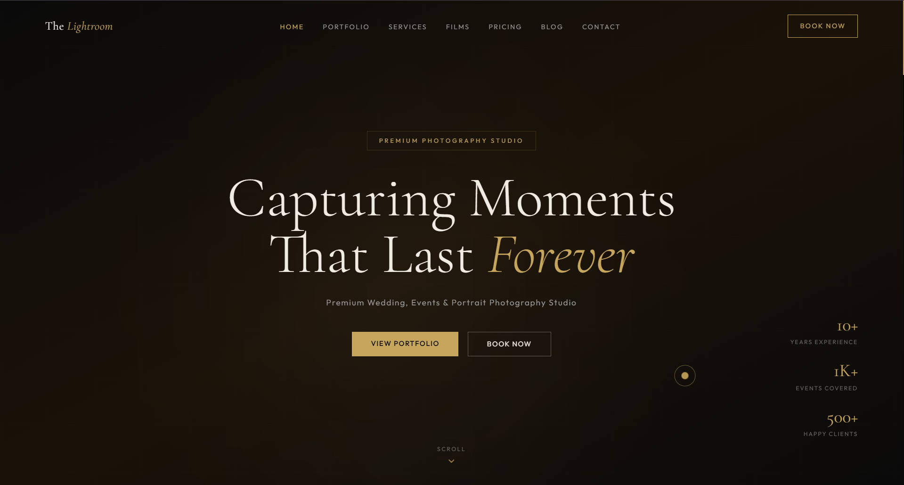
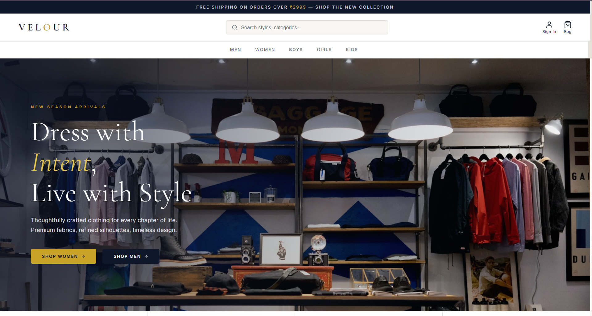
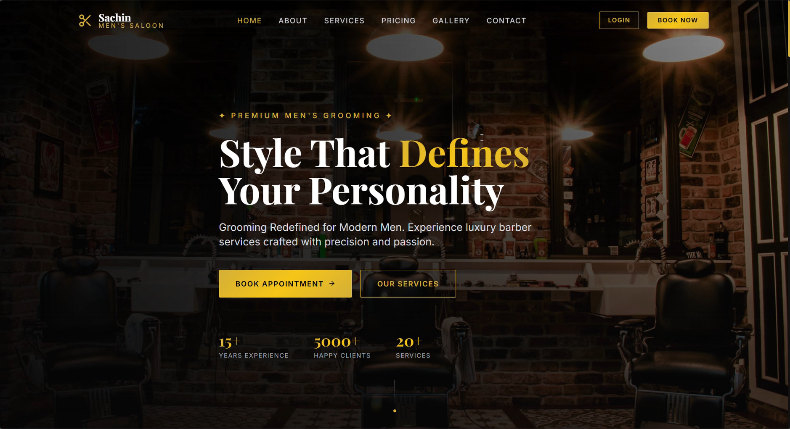
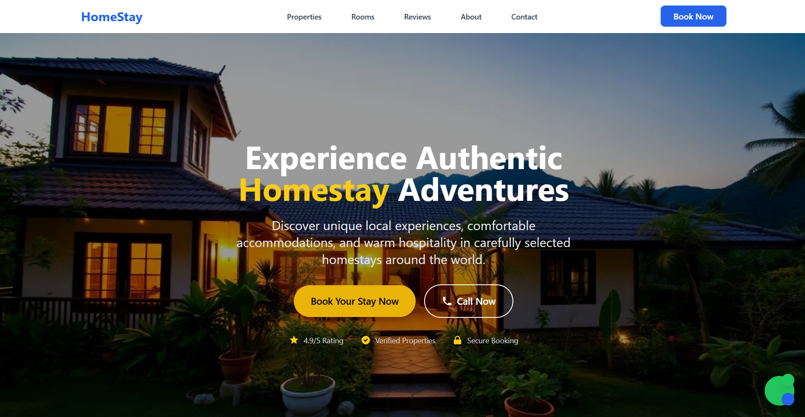
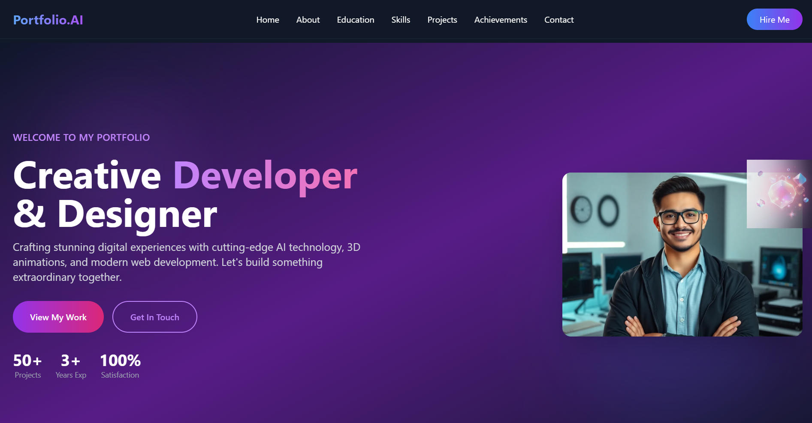
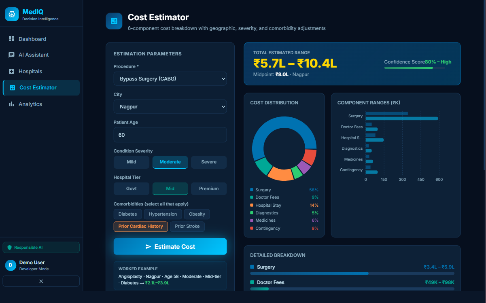
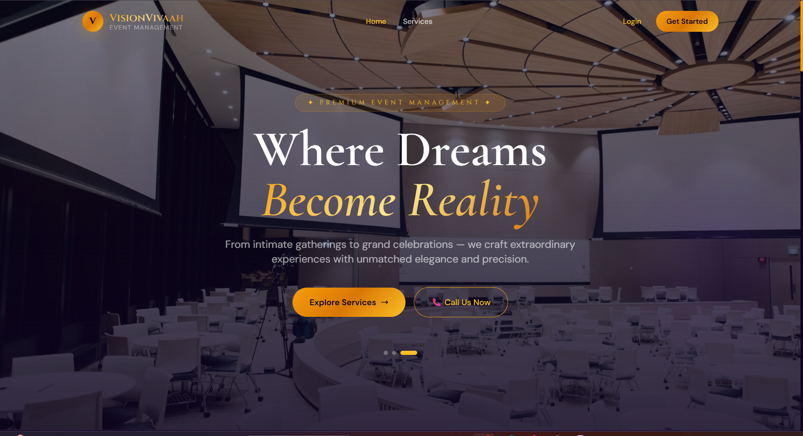

# 🤖 Claude.ai — Testing & Debugging Practice Projects

> A curated collection of **7 real-world, deployed web applications** that I used as playgrounds to sharpen my **testing, debugging, and AI-assisted development skills** — with [Claude.ai](https://claude.ai) as my pair-programming partner throughout.

---

## 👋 About This Repository

This repo is a honest record of my hands-on learning journey with **Claude.ai as a developer tool**.

The idea was simple: instead of just reading about testing and debugging in theory, I took **real, deployed projects** — applications covering photography, fashion e-commerce, salon management, healthcare AI, and event planning — and used Claude.ai to help me:

- 🔍 **Debug** tricky bugs in both frontend and backend code
- 🧪 **Test** edge cases, API endpoints, and authentication flows
- 🛠️ **Refactor** code for better readability, security, and performance
- 📖 **Understand** complex patterns like JWT refresh flows, NLP pipelines, and real-time slot conflict prevention
- 🚀 **Improve** features that were already in production

Every project here is **live and deployed** — not toy apps, not tutorials. They have real databases, real auth systems, and real users in mind. Working on actual deployed code made the debugging practice far more meaningful because the stakes felt real.

> **Why Claude.ai?** I wanted to experience what it feels like to work with an AI that can hold context across a large codebase, suggest fixes with reasoning, and help me think through architecture — not just autocomplete. This repo is the result of that experiment.

---

## 📁 Projects at a Glance

| # | Project | Type | Core Stack | Highlights |
|---|---------|------|------------|------------|
| 01 | [📸 The Lightroom Photography](#01--the-lightroom-photography) | Full-Stack MERN | React, Node, MongoDB, Cloudinary, Razorpay | Booking + payments + private gallery |
| 02 | [🛍️ Velour — Luxury Fashion Store](#02--velour--luxury-fashion-store) | Full-Stack MERN | React, Express, MongoDB | E-commerce with cart & auth |
| 03 | [🪒 Sachin Men's Saloon](#03--sachin-mens-saloon) | Full-Stack MERN | React, Node, MongoDB | Appointment booking + admin analytics |
| 04 | [🏡 HomeStay Landing Page](#04--homestay-landing-page) | Static Landing | HTML, Tailwind CSS | SEO-optimised, fully responsive UI |
| 05 | [💼 Portfolio Landing Page](#05--portfolio-landing-page) | Static Portfolio | HTML, Tailwind CSS | Dark theme, 3D animations, skill bars |
| 06 | [🏥 MedIQ Pro — Healthcare AI](#06--mediq-pro--healthcare-decision-intelligence) | Full-Stack + AI | React, Node, MongoDB, NLP | Hackathon winner — real govt data |
| 07 | [👑 VisionVivaah — Event Management](#07--visionvivaah--event-management-platform) | Full-Stack MERN | React, Node, MongoDB, Cloudinary | Tent house, DJ, catering bookings |

---

## 🔧 Common Technical Threads

Before diving into individual projects, here's what you'll find consistently across this codebase:

- **JWT Authentication** — httpOnly cookies, role-based access control (user / admin / superadmin)
- **MongoDB with Mongoose** — thoughtfully designed schemas with validation, relationships, and seeded demo data
- **RESTful APIs** — clean, well-structured route → controller → model patterns
- **React 18** — functional components, hooks, context API for state management
- **All projects are deployed** — Vercel (frontend), Render (backend), MongoDB Atlas (database)

### 🤖 How Claude.ai Was Used in This Repo

Across all these projects, Claude.ai was used as an active pair-programming partner — not just for writing code, but for the **harder parts of software development**:

| Task | How Claude.ai Helped |
|------|---------------------|
| 🐛 Bug hunting | Traced 404 errors, CORS issues, JWT expiry bugs, and broken API responses across live deployments |
| 🔐 Auth debugging | Fixed httpOnly cookie propagation issues, refresh token race conditions, and role guard failures |
| 🗄️ Database issues | Diagnosed Mongoose query bugs, missing indexes, and schema validation errors |
| 🧪 Edge case testing | Generated test scenarios for booking conflicts, concurrent requests, and payment failure states |
| ♻️ Refactoring | Cleaned up repeated logic, extracted reusable utilities, and improved error handling patterns |
| 📖 Code understanding | Got plain-English explanations of NLP pipelines, Recharts config, and Zustand store design |

The key insight: **debugging deployed apps is fundamentally different from debugging localhost**. Environment variable mismatches, CORS policy differences, cold start latency on Render, and Linux file path case sensitivity — these are the real-world bugs that only surface in production.

---

## 01 — 📸 The Lightroom Photography

> *A premium photography studio management system where clients can book sessions, sign contracts, receive private galleries, and pay online.*



This was a deeply satisfying project to build because it mirrors how a real photography business operates. The admin (photographer) can upload images directly to Cloudinary, manage client galleries, and track bookings and revenue — all from a single dashboard.

### What makes it interesting

One of the trickier parts was **private gallery access**. Each client can only view their own set of delivered photos, not anyone else's. This required careful JWT-based ownership validation on every gallery request.

Another highlight is the **Razorpay payment integration** — clients can pay for their session booking directly in-app, and the admin sees real-time payment status updates.

### Tech Stack

| Layer | Technology |
|-------|-----------|
| Frontend | React 18, Vite, Tailwind CSS, Framer Motion |
| Backend | Node.js, Express.js |
| Database | MongoDB (Mongoose) |
| Auth | JWT + httpOnly cookies |
| Media | Cloudinary (direct uploads) |
| Payments | Razorpay (order creation + verification) |
| Deploy | Vercel (frontend) + Render (backend) |

### Key Features

- ✅ Client registration & login with JWT
- ✅ Photography session booking system
- ✅ Razorpay payment gateway integration
- ✅ Private client galleries with secure access
- ✅ Blog for SEO and content marketing
- ✅ Admin dashboard — bookings, revenue, clients, galleries

### API Surface (selected)

```
POST   /api/bookings               → Create session booking
GET    /api/bookings/my            → Client's own bookings
POST   /api/payment/create-order   → Initiate Razorpay payment
POST   /api/payment/verify         → Verify payment signature
GET    /api/gallery/my             → Private gallery for logged-in client
```

---

## 02 — 🛍️ Velour — Luxury Fashion Store

> *A full-stack e-commerce application for a luxury fashion brand, built with a clean shopping experience from browse to checkout.*



The name "Velour" was chosen intentionally — the project was designed to feel premium. The UI is clean and minimal, and the backend is solid with proper auth and product management.

### Tech Stack

| Layer | Technology |
|-------|-----------|
| Frontend | React 18 (CRA), React Router v6, Axios |
| Backend | Node.js, Express.js (ES Modules) |
| Database | MongoDB (Mongoose) |
| Auth | JWT + bcrypt |

### What I Built

- User authentication (register, login, profile)
- Product browsing with category filters
- Shopping cart with quantity management
- Order placement and order history
- Admin product management
- Responsive, mobile-first design

### Quick Start

```bash
# Backend
cd server && npm install && npm run seed
npm run dev   # runs at localhost:5000

# Frontend
cd client && npm install
npm start     # runs at localhost:3000
```

---

## 03 — 🪒 Sachin Men's Saloon

> *A luxury grooming management application for a men's salon — complete with appointment booking, double-booking prevention, gallery, analytics, and a gorgeous gold-on-black theme.*



This project is one of my personal favourites because of the attention to detail in both UX and backend logic. The **real-time slot availability system** ensures that no two customers can book the same time slot on the same day.

### What makes it interesting

The slot-conflict algorithm on the backend checks existing bookings for a given date and filters out already-occupied time slots before returning available ones to the client. This prevents double-booking without any extra database overhead.

The admin dashboard uses **Recharts** to visualise booking trends and revenue — giving the salon owner actionable insights at a glance.

### Tech Stack

| Layer | Technology |
|-------|-----------|
| Frontend | React 18, Vite, Tailwind CSS, Framer Motion, Recharts |
| Backend | Node.js, Express.js |
| Database | MongoDB (Mongoose) |
| Auth | JWT + bcryptjs |
| Theme | Gold (#d4af37) on Black (#0a0a0a) |

### Key Features

- ✅ Real-time slot availability check (no double booking)
- ✅ 6 service categories with full CRUD (admin)
- ✅ Masonry gallery with lightbox
- ✅ Admin analytics dashboard (Recharts)
- ✅ Booking approval workflow
- ✅ User booking history & cancellation
- ✅ Seeded with 12 services, 8 gallery images, and an admin account

### Database Schemas (summary)

```
User:    name, email, password(bcrypt), phone, role(user|admin)
Service: title, category(6 types), price(INR), duration(mins), isActive
Booking: userId, serviceId, date, timeSlot, status(pending/approved/cancelled/completed)
Gallery: image(URL), category, caption
```

### Default Login

| Role | Email | Password |
|------|-------|----------|
| Admin | admin@sachinsaloon.com | Admin@123 |

---

## 04 — 🏡 HomeStay Landing Page

> *A high-quality, SEO-optimised landing page for a homestay business — built entirely in HTML and Tailwind CSS, no framework needed.*



Sometimes the right tool is a well-crafted static page. This project demonstrates that you don't always need React to build something beautiful and functional.

The page includes a property carousel, testimonial slider, room detail cards, an FAQ accordion, and a floating WhatsApp/contact button — all built with vanilla JavaScript event listeners and Tailwind.

### Tech Stack

- HTML5 + Tailwind CSS (CDN)
- Lucide Icons
- Vanilla JavaScript for interactivity

### Key Sections

- 🏠 Hero section with property images and CTAs
- 🛏️ Room types (Standard, Deluxe, Family Suite, Premium)
- ⭐ Guest testimonials carousel
- 🏅 Trust badges and certifications
- ❓ FAQ accordion
- 📞 Floating call/chat button

### SEO Highlights

Full meta tags, Open Graph tags, Twitter Card tags, canonical URL, semantic HTML structure with proper heading hierarchy — all baked in from day one.

---

## 05 — 💼 Portfolio Landing Page

> *A personal portfolio template with a dark, futuristic aesthetic — featuring animated skill bars, an achievements counter, and a multi-section layout.*



This is a well-structured single-page portfolio built with HTML and Tailwind CSS. The design uses a dark slate + purple gradient palette, smooth hover transitions, and an animated hero section that immediately establishes a professional impression.

### Tech Stack

- HTML5 + Tailwind CSS (CDN)
- Lucide Icons
- CSS animations + Vanilla JS

### Key Sections

- 🎯 Animated hero with gradient text and floating shapes
- 👤 About section with availability indicator
- 🎓 Education timeline + certifications
- 📈 Animated skill bars (React, Node, MongoDB, etc.)
- 🏆 Achievements with counter animation
- 🗂️ Project cards with live + GitHub links
- 📬 Contact form + social links

---

## 06 — 🏥 MedIQ Pro — Healthcare Decision Intelligence

> *A production-grade AI-powered platform that helps patients find the right hospital for their procedure and understand realistic costs — built for the **TenzorX 2026 · Poonawalla Fincorp National AI Hackathon**.*



This is the most technically ambitious project in this collection. MedIQ Pro is essentially **"Kayak for Healthcare"** — you describe your medical need in plain language, and the platform surfaces ranked hospitals, realistic cost estimates, and a step-by-step clinical pathway.

### What makes it special

Every piece of data in this platform is sourced from **real Indian government datasets**:

- **PM-JAY HBP 2.2** (National Health Authority) — 1,949 government benchmark rates
- **NABH Accreditation Portal** — hospital quality and trust signals
- **CGHS Rate Zones** (Ministry of Health) — city-tier pricing multipliers
- **ICD-10 / SNOMED CT** (WHO / NCI) — clinical code mapping
- **data.gov.in** — state-wise hospital infrastructure statistics

### The AI Pipeline

```
User query (natural language)
  ↓ parseIntent() — extracts procedure, city, budget, age, severity
  ↓ ICD-10 + SNOMED CT mapping
  ↓ 4-signal hospital ranking algorithm:
       Clinical    (35%) → procedure capability, accreditation
       Reputation  (30%) → ratings, reviews, NLP sentiment
       Accessibility (20%) → beds, ICU availability
       Affordability (15%) → tier-based scoring
  ↓ 6-component cost estimation:
       Procedure + Doctor + Stay + Diagnostics + Medicines + Contingency
       × Geographic (CGHS) × Severity × Comorbidity × Age × Hospital Tier
  ↓ Confidence score + risk flags + ICD-10 chips
```

### Tech Stack

| Layer | Technology |
|-------|-----------|
| Frontend | React 18, Zustand (state management), Axios |
| Backend | Node.js, Express.js |
| Database | MongoDB (Mongoose) |
| Auth | JWT (access 7d + refresh 30d) + httpOnly cookies |
| NLP | Custom intent parser (no external API dependency) |
| Seeded Data | 16 real hospitals, 13 PM-JAY procedures |

### Security & Enterprise Features

- RBAC: `customer` / `admin` / `superadmin` roles
- Auto token refresh via Axios interceptor
- bcrypt with 12 salt rounds
- Full audit logging for all admin actions
- `RequireAuth` and `RequireAdmin` component-level guards

### Default Logins

| Role | Email | Password |
|------|-------|----------|
| Admin | admin@mediq.ai | Admin@MedIQ2026 |
| Customer | rahul@demo.com | Demo@1234 |

---

## 07 — 👑 VisionVivaah — Event Management Platform

> *A full-stack booking platform for wedding and event services — tent house, DJ, catering, decoration, and full event coordination.*



VisionVivaah was built with the goal of giving small event service providers a professional online presence they could actually use. The platform handles the complete journey from browsing services to placing a booking, tracking it, and marking payment.

### What makes it interesting

The **multi-step booking form** breaks down the booking process into digestible steps — service selection, event details, date/time, and payment method — reducing user drop-off compared to a single overwhelming form.

The **mock payment flow** is designed to be easily swapped with a real gateway (Razorpay or Stripe) without touching any other code — the controller is fully isolated.

### Tech Stack

| Layer | Technology |
|-------|-----------|
| Frontend | React 18, Vite, Tailwind CSS, React Router v6 |
| Backend | Node.js, Express.js |
| Database | MongoDB (Mongoose) |
| Auth | JWT + bcryptjs |
| Images | Cloudinary (with local fallback) |
| Notifications | react-hot-toast |

### Key Features

- ✅ 5 service categories (Tent House, DJ, Catering, Decoration, Full Event)
- ✅ Multi-step booking form with validation
- ✅ Mock payment with transaction ID generation
- ✅ Booking status tracker with visual progress bar
- ✅ Image upload (Cloudinary + local storage fallback)
- ✅ Admin CRUD for services, bookings, and users
- ✅ Password strength meter on registration
- ✅ Skeleton loading states throughout

### Page Routes

| Route | Description |
|-------|-------------|
| `/` | Home — hero, service preview, testimonials |
| `/services` | Browse with search & category filters |
| `/services/:id` | Service detail with booking sidebar |
| `/book/:serviceId` | Multi-step booking flow |
| `/dashboard` | User's bookings + status tracking |
| `/admin` | Admin stats dashboard |
| `/admin/services` | Manage services (CRUD + image upload) |

### Default Logins

| Role | Email | Password |
|------|-------|----------|
| Admin | admin@eventplatform.com | Admin@123 |
| User | rajesh@example.com | User@123 |

---

## 🛠️ Technologies Used Across All Projects

```
Frontend       React 18, Vite, CRA, HTML5, Tailwind CSS, Framer Motion
State Mgmt     React Context API, Zustand
Backend        Node.js, Express.js
Database       MongoDB, Mongoose
Auth           JWT (access + refresh tokens), bcrypt, httpOnly cookies
Media          Cloudinary
Payments       Razorpay
Charts         Recharts
Real-time      Socket.io (Chat App)
Icons          Lucide, react-icons
Notifications  react-hot-toast
Deploy         Vercel (frontend), Render (backend), MongoDB Atlas
```

---

## 📚 What Debugging These Projects With Claude.ai Taught Me

Every project surfaced different debugging challenges — and using Claude.ai as the thinking partner made the learning stick faster:

| Project | Key Debugging / Testing Lesson |
|---------|-------------------------------|
| **Lightroom** | Traced Razorpay signature mismatch errors; debugged Cloudinary upload failures on production vs. local |
| **Velour** | Fixed ES Module import/export issues that only broke on Render (not on Windows localhost) |
| **Sachin Saloon** | Identified and fixed a race condition in the slot-conflict check when concurrent bookings arrived |
| **HomeStay / Portfolio** | Learned to validate SEO and accessibility manually when there's no framework to lean on |
| **MedIQ Pro** | Debugged NLP intent parser returning wrong procedure matches; traced RBAC guard failures on the admin panel |
| **VisionVivaah** | Fixed a payment status sync bug where the booking stayed `unpaid` even after successful mock payment |

### 🧠 The Bigger Takeaway

Using Claude.ai to work through real deployed codebases taught me something no tutorial can:

> **Production bugs are rarely where you expect them.** The bug is almost never in the line you're staring at — it's usually in the surrounding context: a missing env variable on the server, a stale JWT in the client, a Mongoose schema field that wasn't indexed, or an API response shape that silently changed.

Claude.ai's ability to hold the full context of a conversation — reading through multiple files, understanding relationships between components, and reasoning about *why* something fails — is what made it genuinely useful as a debugging partner, not just a code generator.

---

## 🤝 Let's Connect

If you're a recruiter, developer, or someone curious about AI-assisted development — I'd love to hear from you.

| Platform | Link |
|----------|------|
| 🌐 Portfolio | *(link your live portfolio here)* |
| 💼 LinkedIn | *(link your LinkedIn here)* |
| 🐙 GitHub | *(link your GitHub profile here)* |
| 📧 Email | *(your email here)* |

---

*Debugged, tested, and refined with Claude.ai — because the best way to learn debugging is to debug something real. 🔧*
